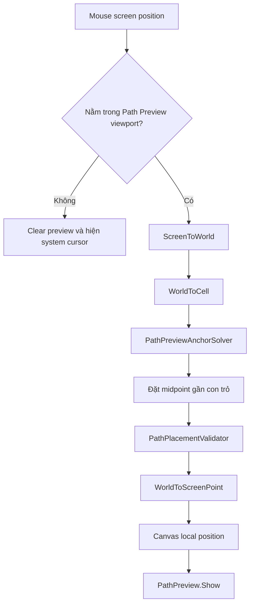

# Audere Puzzle Gameplay — kiến trúc Steptile

Tài liệu này mô tả implementation hiện tại của gameplay puzzle trong scene `20_Game`, cách chỉnh viewport, cách tạo level và hướng mở rộng tile/path piece về sau.

## 1. Kết quả hiện tại

- Board được sinh từ `PuzzleData`, không hard-code layout bằng GameObject trong scene.
- Tile được tách thành prefab riêng. Hiện có `Grass`, `Goal` và `Dialogue`.
- Player, tile, Path Preview, Path Piece Hand và card đều là prefab.
- Path Preview được vẽ bằng Canvas/UI nhưng luật chơi vẫn dùng grid coordinate.
- `PuzzleViewportMask` **không phải UI**. Đây là camera-space prefab, child trực tiếp của `Main Camera`, gồm bốn SpriteRenderer đen và luôn đi theo camera follow.
- Camera đi theo Player và board có thể dài hơn vùng đang nhìn thấy.
- Preview chỉ hoạt động trong vùng RectTransform của `Path Preview UI`; ra ngoài vùng này preview biến mất và con trỏ hệ điều hành hiện lại.
- Player có animation rơi khi path đi ra cell không có tile.
- Có Map Editor để vẽ map, đặt Player/Goal, chọn path piece và lưu thành `PuzzleData`.

Level test hiện tại quay về map cơ bản rộng 7 cột, từ `x = -3` đến `x = 3`, cao 3 hàng:

- Player: `(-3, 0)`
- Goal: `(3, 0)`
- Hand: đúng 3 piece `Line4`

## 2. Scene hierarchy

```text
Main Camera
└── PuzzleViewportMask            camera-space prefab; chỉ active trong Puzzle
    ├── Mask Top                  SpriteRenderer
    ├── Mask Bottom               SpriteRenderer
    ├── Mask Left                 SpriteRenderer
    └── Mask Right                SpriteRenderer

GameplayUIRoot                    persistent root Canvas
├── PuzzleUI
│   └── Path Piece Hand UI
│       └── Cards
└── DialogueUI
    ├── Left
    └── Right

EventSystem

WORLD
├── Puzzle Root                  GridSpace2D; tắt khi preview combat
    ├── Path Preview             world-space preview Canvas
    │   ├── Connector Root
    │   ├── Endpoint A
    │   └── Endpoint B
    ├── Player
    │   └── shadow (1)           Grounded visual; không nhận hop/squash
    ├── StepTile Board
    ├── Goal
    └── Placed Path Root
└── Combat Root                  sibling mode root; xem 06_CombatGameplay.md
    └── CombatBoard              world-space Canvas prefab

SYSTEMS
├── Puzzle Systems                lifecycle group
│   ├── Puzzle Manager
│   ├── Path Placement Controller
│   └── Board Controller
└── Combat Systems
    └── Combat Controller
```

`Placed Path Root` thuộc `Puzzle Root`. `PuzzleViewportMask` thuộc camera vì nó mô tả viewport chứ không mô tả map. `WorldModeController` vẫn bật/tắt mask cùng `Puzzle Root`, `PuzzleUI` và `Puzzle Systems`, nên mask không xuất hiện trong Combat.

## 3. Puzzle Viewport Mask dạng world object

Prefab:

```text
Assets/_Audere/Prefabs/Puzzle/Camera/PuzzleViewportMask.prefab
```

Mask được tạo từ bốn object đen bao quanh vùng chơi:

```text
┌──────────────────────────────┐  Mask Top
│                              │
├──────┐                ┌──────┤
│ Left │   GAME VIEW    │Right │
├──────┘                └──────┤
│                              │
└──────────────────────────────┘  Mask Bottom
```

Mỗi phần chỉ có `Transform + SpriteRenderer`. Không có runtime code sinh khung, đổi màu hoặc tính scale.

### Cách chỉnh trong Scene

1. Mở `Main Camera > PuzzleViewportMask`.
2. Mở prefab hoặc unpack nếu muốn tùy biến riêng theo scene.
3. Chỉnh `Position` và `Scale` của `Mask Top`, `Mask Bottom`, `Mask Left`, `Mask Right`.
4. Bốn SpriteRenderer dùng màu đen và Sorting Order cao để che world object.
5. Sau khi đổi vùng hở, chỉnh RectTransform của `WORLD > Puzzle Root > Path Preview` cho khớp vùng gameplay nhìn thấy.

Camera render full screen. Bốn world object là phần thực sự che nội dung bên ngoài; không dùng Image UI để giả lập black box.

## 4. Path Preview UI

Prefab:

```text
Assets/_Audere/Prefabs/Puzzle/UI/PathPreviewUI.prefab
```

Art source:

- Endpoint A/B: `Assets/_Audere/AssetGame/Step Tile/cursor.aseprite`
- Connector: `Assets/_Audere/AssetGame/Step Tile/tile.aseprite`

Preview có hai endpoint kích thước tương đương tile và nhiều connector nhỏ ở giữa. Số connector được tính theo chiều dài path; spacing, size và smoothing chỉnh trên prefab.

Con trỏ chuột không kéo endpoint bám tự do. Flow hiện tại:



`PathPreview` chỉ vẽ dữ liệu đã được xử lý. Nó không biết luật Goal, board coverage hay điều kiện commit.

## 5. Board, grid và camera

Grid math không bị giới hạn theo kích thước màn hình. `BoardManager` mới là nơi biết cell nào thật sự có tile.

`GridCameraFollow2D`:

- bám theo Player;
- có dead zone để tránh camera rung theo từng bước nhỏ;
- dùng SmoothDamp;
- clamp theo world bounds của board;
- hỗ trợ board dài 20 ô hoặc hơn.

`PuzzleViewportMask` là child của `Main Camera`, local position `(0, 0, 9)` để render tại world Z `-1` khi camera ở Z `-10`. Vì vậy camera follow có di chuyển thế nào thì vùng hở vẫn cố định trên màn hình. Lifecycle Puzzle/Combat do reference riêng trong `WorldModeController` quản lý.

## 6. Tile prefab và type

| Type | Stable ID | Prefab | Behaviour |
| --- | --- | --- | --- |
| `Grass` | `grass` | `Assets/_Audere/Prefabs/Puzzle/Tiles/Grass.prefab` | `GrassTileBehaviour` |
| `Goal` | `goal` | `Assets/_Audere/Prefabs/Puzzle/Tiles/Goal.prefab` | `GoalTileBehaviour` |
| `Dialogue` | `dialogue` | `Assets/_Audere/Prefabs/Puzzle/Tiles/Dialogue.prefab` | `DialogueTileBehaviour` |

`BoardManager` lấy prefab từ `PuzzleTileCatalog`. Nó không đổi màu tile bằng code và không chứa nhánh visual riêng cho Goal.

Khi thêm tile mới:

1. Thêm enum `PuzzleTileType`.
2. Thêm stable ID trong `PuzzleContentConstants.Tiles`.
3. Tạo prefab riêng chứa art và behaviour.
4. Thêm prefab vào `PuzzleTileCatalog.asset`.
5. Tile mới sẽ dùng được trong Map Editor.

## 7. Path piece và constants

| Type | Stable ID | Data asset |
| --- | --- | --- |
| `Line2` | `line-2` | `PathPiece_Line_2.asset` |
| `LCorner` | `l-corner` | `PathPiece_L_Corner.asset` |
| `Line4` | `line-4` | `PathPiece_Line_4.asset` |

Stable ID được khai báo trong:

```text
Assets/_Audere/Scripts/Puzzle/PuzzleContentConstants.cs
```

`PathPieceData.OrderedLocalPath` lưu các cell theo đúng thứ tự Player sẽ đi. Hai phần tử đầu/cuối là hai endpoint.

Level quyết định card bằng danh sách `Available Path Pieces`, nhưng hand có giới hạn cứng `PuzzleContentConstants.Hand.MaxSlots = 3`. Runtime chỉ sinh `Path Piece 01`, `02`, `03`; Map Editor cũng khóa nút thêm và báo validation nếu data vượt quá ba piece.

### Path Piece Card và trạng thái chọn

Art của khung slot:

```text
Assets/_Audere/AssetGame/Step Tile/slot.aseprite
```

Prefab card được tách visual thành hai nhánh độc lập:

```text
PathPieceCardUI
├── Slot Motion Root
│   └── Slot Frame            slot.aseprite; chỉ khung này wobble
└── Piece Root                ký hiệu piece đứng yên
    ├── Middle Node Template
    └── Endpoint Node Template
```

Khi bấm một card:

1. Toàn card nhấc lên `18 px` và scale nhẹ tới `1.025`.
2. `Slot Motion Root` lắc qua lại bằng position + rotation.
3. `Piece Root` không xoay, nên hình piece ở trong giữ ổn định.
4. Bấm lại chính card đang chọn sẽ toggle về trạng thái chưa chọn, hạ xuống và trả toàn bộ transform về vị trí ban đầu.
5. Chọn card khác sẽ chuyển trạng thái chọn sang card mới.

Thông số layout/polish hiện tại nằm trên prefab, không hard-code art hoặc màu trong controller:

- Card: `128 × 128 px`
- Khoảng cách giữa card: `24 px`
- Lift: `18 px`
- Wobble angle: `2.6°`
- Wobble distance: `2.2 px`
- Wobble frequency: `2.35 Hz`

## 8. Placement và rơi

Một placement được commit khi:

1. Piece data hợp lệ.
2. Một endpoint nối với vị trí hiện tại của Player.
3. Con trỏ đủ gần midpoint preview.

Path được phép đi ra cell không có tile. Khi đó `PlacementResult.WillFall = true` và Player:

1. đi tới cell thiếu tile;
2. khựng nhẹ ở mép;
3. drift theo hướng di chuyển;
4. rơi, xoay, thu nhỏ và fade;
5. ẩn SpriteRenderer;
6. giữ bóng ở cell an toàn cuối cùng, rồi ẩn bóng khi fall hoàn tất;
7. reload level sau một khoảng ngắn.

## 8.1. Step feel và tile landing feedback

Player movement hiện dùng một nhịp hoàn chỉnh thay vì chỉ `Lerp` thẳng giữa hai cell:

1. Vị trí chạy bằng `SmootherStep` để rời ô và chạm ô không bị giật vận tốc.
2. Giữa bước có arc cao `0.075 world unit` và stretch nhẹ theo trục dọc.
3. Khi chạm cell, Player squash trong `0.085 giây` rồi trả về scale gốc.
4. Tile nhận `OnPlayerEntered` cùng thời điểm va chạm và tự chạy press → rebound → settle.
5. Child có tên bắt đầu bằng `shadow` được `GridPlayer` nhận tự động làm grounded shadow: bóng vẫn trượt ngang theo cell nhưng giữ nguyên world Y, rotation và scale trong toàn bộ hop/landing.

`shadow (1)` vẫn nằm trong `Player.prefab` để đi theo logical player. `GridPlayer` bù transform ở runtime, vì vậy không cần tách bóng ra ngoài prefab và không cần kéo reference thủ công trong Inspector.

Tile feedback nằm trên từng prefab, không nằm trong `BoardManager`:

```text
Grass / Goal prefab
├── BoardTile
├── tile-specific behaviour
├── TileStepFeedback
└── Visual Root
    └── toàn bộ SpriteRenderer của tile
```

`TileStepFeedback` chỉ animate `Visual Root`, còn root của `BoardTile` giữ nguyên tọa độ grid. Vì vậy logic, camera bounds và lookup cell không bị ảnh hưởng bởi squash/stretch.

Thông số mặc định hiện tại:

- Press: `0.055 s`, hạ `0.065`, scale khoảng `(1.045, 0.91)`.
- Rebound: `0.085 s`, nhấc `0.018`, stretch nhẹ.
- Settle: `0.14 s` về đúng local position/scale ban đầu.

Tile type mới có thể dùng nhịp khác bằng cách chỉnh `TileStepFeedback` trên chính prefab đó.

## 8.2. Path Preview retarget và state palette

Khi preview đổi cell hoặc hình path:

- endpoint/connector vẫn lerp vị trí bằng exponential smoothing;
- toàn preview scale nhanh từ `0.88 → 1.0`, tạo một nhịp xác nhận nhỏ;
- connector mới được seed tại đúng target nên không bay từ tâm Canvas;
- màu và scale của `Valid`, `Invalid`, `Dangerous` được serialize trên `PathPreviewUI.prefab`;
- controller chỉ gửi `PresentationState`, không chứa mã màu theo state.

Palette hiện tại:

- Valid: vàng kem dịu, scale `1.0`.
- Invalid: đỏ đất `#A45D5D`, scale `0.94`.
- Dangerous: cam đất, scale `0.98`.

Endpoint gameplay bằng `0.86` kích thước tile; middle block `7.5 px`, spacing `13 px` để đường nối có nhiều ô nhỏ nhưng không bị đặc.

## 9. Puzzle Map Editor

Mở bằng:

```text
Audere > Puzzle > Map Editor
```

Workflow:

1. Chọn hoặc tạo `PuzzleData`.
2. Paint tile bằng Tile Type.
   - Với `Dialogue`, click cell rồi gán `Dialogue Data` và `Trigger Once` trong phần `Selected Cell`.
3. Đặt Player và Goal.
4. Thêm/tạo thứ tự path piece trong hand.
5. `Save Data` để lưu asset.
6. `Apply to Scene` để gán cho `PuzzleManager`.
7. `Apply & Play` để chạy thử.

Board data không bị giới hạn bởi `PuzzleViewportMask`. Mask chỉ quyết định vùng camera được nhìn thấy, còn map có thể dài/rộng hơn.

## 10. Asset chính

```text
Assets/_Audere/Scenes/20_Game.unity

Assets/_Audere/Prefabs/Puzzle/Camera/PuzzleViewportMask.prefab
Assets/_Audere/Prefabs/Puzzle/Actors/Player.prefab
Assets/_Audere/Prefabs/Puzzle/Tiles/Grass.prefab
Assets/_Audere/Prefabs/Puzzle/Tiles/Goal.prefab
Assets/_Audere/Prefabs/Puzzle/Tiles/Dialogue.prefab
Assets/_Audere/Prefabs/Puzzle/UI/PathPreviewUI.prefab
Assets/_Audere/Prefabs/Puzzle/UI/PathPieceHandUI.prefab
Assets/_Audere/Prefabs/Puzzle/UI/PathPieceCardUI.prefab

Assets/_Audere/Data/Puzzle/PuzzleTileCatalog.asset
Assets/_Audere/Data/Puzzle/Puzzle_MVP_01.asset
Assets/_Audere/Data/Dialogue/DialogueCharacterCatalog.asset
Assets/_Audere/Data/Dialogue/Dialogue_Sample.asset
Assets/_Audere/Data/Puzzle/PathPieces/PathPiece_Line_2.asset
Assets/_Audere/Data/Puzzle/PathPieces/PathPiece_L_Corner.asset
Assets/_Audere/Data/Puzzle/PathPieces/PathPiece_Line_4.asset
```

## 11. QA gần nhất

Đã kiểm tra trực tiếp bằng Unity MCP trong Play Mode:

- Unity 6.0.79f1 kết nối thành công.
- Console: `0` error.
- `Main Camera/PuzzleViewportMask`: đúng 4 child `Top/Bottom/Left/Right`, mỗi child có SpriteRenderer; active trong Puzzle và inactive trong Combat.
- `WORLD/Puzzle Root/Placed Path Root`: nằm cùng lifecycle với board, goal và preview.
- `StepTile Board`: sinh 20 Grass; Goal sinh riêng trong Goal root, tổng map 7 × 3.
- `Path Piece Hand UI/Cards`: đúng 3 card.
- Gameplay HUD và dialogue dùng chung đúng `1` root Canvas: `GameplayUIRoot/PuzzleUI|DialogueUI`; Canvas scene cũ đã được gỡ.
- `PuzzleManager.hand` và `PathPlacementController.puzzleCanvas` tự bind lại vào UI persistent.
- Card thường dùng đúng `slot.aseprite`, size `128 × 128`, spacing `24`.
- Card được chọn: `y = 18`, scale `1.025`; khung slot wobble trong khi `Piece Root` giữ rotation `0°`.
- Toggle lần hai: `y = 0`, scale `1`, slot position/rotation trở về `0`, selection được clear.
- `Grass` và `Goal`: đủ 21 instance `TileStepFeedback`; visual luôn settle về position `(0,0,0)` và scale `(1,1,1)`.
- Traversal test `(-3,0) → (0,0)`: Player kết thúc đúng grid, scale trở lại `(0.72,0.72,0.72)`.
- Grounded-shadow runtime probe: trong trạng thái giữa bước có hop + stretch, world Y của bóng giữ nguyên `-0.077438`; sai lệch position và scale đều bằng `0`.
- Path Preview: retarget scale đo được `0.88 → 1.0`; Invalid đổi đúng `#A45D5D` và endpoint còn khoảng `94%`.
- Scene override cũ làm mất `Connector Template` đã được gỡ; runtime sinh thành công 20–25 connector.
- Runtime screenshot card được chọn: `Assets/Screenshots/slot_selected_verified.png`.
- Runtime screenshot palette mới: `Assets/Screenshots/polish_step_idle.png`.
- Runtime screenshot preview mới: `Assets/Screenshots/polish_preview_valid_fixed.png`.
- Build `Assembly-CSharp` và `Assembly-CSharp-Editor`: `0 warning`, `0 error`.
- `Puzzle_MVP_01`: 19 Grass, 1 Dialogue tại `(0,0)`, 1 Goal; Dialogue cell dùng sample data và trigger một lần.
- Runtime dialogue được kiểm tra trong Play Mode; `GameplayUIRoot` là root độc lập, còn Main Menu dùng UI riêng.
- Dialogue tile Inspector hiển thị `Dialogue Data`, `Trigger Once`, `Triggered`; khi chạy có thể sửa trực tiếp và ghi về đúng cell trong `PuzzleData`, đồng thời có nút mở Puzzle Map Editor.
- Runtime screenshots sau khi gộp UI: `Assets/Screenshots/gameplay_ui_merged_verified.png` và `Assets/Screenshots/gameplay_ui_merged_dialogue_verified.png`.
- Mode-switch regression: Combat → Puzzle dựng lại đủ 20 tile runtime; Puzzle → Combat tắt toàn bộ puzzle world/systems mà không để controller con kẹt inactive.

## 12. Phần còn chờ polish/art

- `Placed Path Root` đã có nhưng renderer cho path sau commit chưa hoàn thiện đầy đủ.
- Preview đã có slot visual state `Valid`, `Invalid`, `Dangerous`; cần art/prefab variant riêng nếu muốn phân biệt mạnh hơn.
- `PuzzleViewportMask` hiện là khung đen camera-space để dễ chỉnh layout; có thể thay sprite/material trên chính prefab mà không sửa gameplay code.
